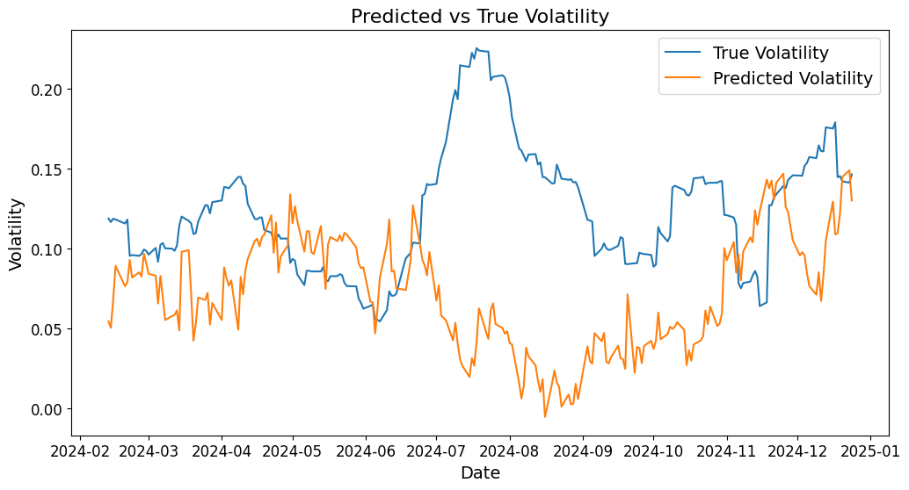
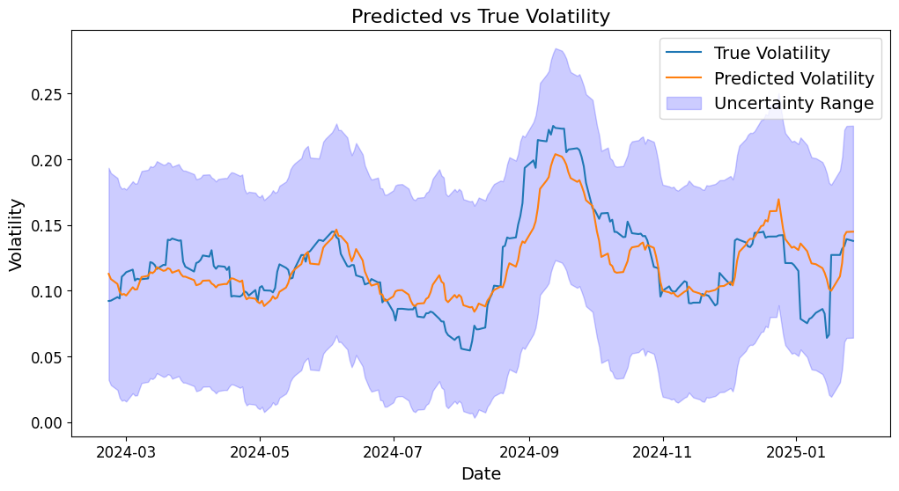

# Data

## Extract
Nous utilisons quatre sources de données : Yahoo finance, FRED, CBOE et un site internet pour les évènements géopolitiques.

### Yahoo finance
Nous utilisons l'API de Yahoo finance pour récupérer les prix et les volumes de transactions des actifs suivants :
* Indices actions : S&P 500, Nasdaq, Dow Jones, Nikkei, EuroStoxx 50, FTSE
* Matières premières : Or, Argent, Pétrole, Gaz
* Taux de change : EUR/USD, USD/JPY, GBP/USD
* Taux d'intérêts : taux des obligations américaines de maturité 2 et 10 ans
* ETFs sur des obligations corporate américaines : Investment grade et High yield

Nous calculons alors les returns et la volatilité de chacun de ces actifs.

### FRED
Nous utilisons l'API de [FRED](https://fred.stlouisfed.org/) à partir de [pandas_datareader](https://pandas-datareader.readthedocs.io/en/latest/) afin d'obtenir les taux d'intérêts à 1 mois des obligations américaines et le CPI (Consumer Price Index). 

### Evènements géopolitiques
Nous avons utilisé ce [dataset](https://www.matteoiacoviello.com/gpr.htm) afin d'obtenir des données sur les évènements géopolitiques ayant pu avoir un impact sur la volatilité du S&P 500. Ce dataset doit être placé manuellement à l'emplacement du code sous le nom `data_gpr_daily_recent.xls`.

### CBOE
Les données sur les volumes traités d'options ne sont pas disponibles via Yahoo finance mais nous semblaient pertinentes puisque les investisseurs institutionnels utilisent ces produits. Nous avons donc utilisé le site du CBOE (Chicago Board Options Exchange) afin d'obtenir ces [données](https://www.cboe.com/us/options/market_statistics/historical_data/). Ce dataset doit être placé manuellement à l'emplacement du code sous le nom `daily_volume_SPX.csv`.

## Transform
Nous avons ensuite rempli les données manquantes. Certaines données macroéconomiques (notamment le CPI) étant mensuelles, nous conservons la dernière valeur (avec `ffill`). Nous gérons les jours fériés à l'étranger en reprenant les valeurs de la journée précédente (il y a suffisamment peu de jours fériés pour que ce choix ait un impact négligeable) et supprimons les jours fériés américains. 

Nous ajoutons ensuite deux variables RSI ([Relative Strength Index](https://fr.wikipedia.org/wiki/Relative_strength_index)) de 10 et 22 jours ainsi qu'une variable EMA ([Moyenne mobile exponentielle](https://fr.wikipedia.org/wiki/Moyenne_mobile#Moyenne_mobile_exponentielle)) sur 26 jours et une variable MACD ([Convergence et Divergence des Moyennes Mobiles](https://fr.wikipedia.org/wiki/MACD)) et sa variable associée de signal.

On supprime ensuite les variables les plus corrélées à l'aide d'une matrice de corrélation.

# Modèles
## Features selection
Nous avons dans un premier temps cherché à réduire le nombre de variables afin de réduire les risques de surapprentissage, d'améliorer la robustesse des prédictions et de réduire la complexité du modèle et son temps d'entraînement en limitant l'information redondante à travers les variables.

### ElasticNet
Nous avons d'abord utilisé `ElasticNet` qui combine les régularisations Lasso et Ridge et permet de ne garder que les colonnes dont les coefficients sont non-nuls. Nous avons dans un premier temps utilisé une GridSearch afin de trouver les hyperparamètres optimaux mais le nombre de variables conservées était trop grand donc nous avons imposé manuellement les hyperparamètres pour ne garder qu'un nombre limité de variables.

### Analyse en composantes principales
Afin de conserver un maximum de variance (et donc d’explicabilité) avec un minimum de variables, nous avons finalement fait le choix d'utiliser l’analyse en composantes principales. 

Nous estimons que conserver 30 variables et 80% de la variance est un bon compromis.

## Modèles autorégressifs
Nous choisissons de commencer par des modèles économétriques simples, qui n'utilisent que les returns et la volatilité passée comme variables explicatives. 
### EWMA (Exponential Weighted Moving Average)
Nous commençons par appliquer un modèle EWMA : $$\sigma_n^2 = \lambda \sigma_{n-1}^2 + (1-\lambda) r_{n-1}^2$$ où $\sigma_n$ représente la volatilité et $r_n$ le return au temps $n$. 

Malheureusement, nous observons ici une caractéristique classique des modèles EWMA : ils ne prédisent pas vraiment l'avenir mais ont tendance à observer un lag temporel persistant.

### GARCH (Generalized Autoregressive Conditional Heteroskedasticity)
Nous utilisons ensuite un modèle plus complexe GARCH : $$\sigma_n^2 = \gamma \sigma_{\infty}^2 + \alpha r_{n-1}^2 + \beta \sigma_{n-1}^2$$ où $\sigma_{\infty}$ représente la moyenne long-terme de la volatilité.

Bien que les métriques de performance s'améliorent, le modèle GARCH ne capture clairement pas la structure de volatilité, proposant des variations d'amplitude limitée.

Nous avons ensuite utilisé la libraire `arch` afin de pouvoir inclure les variables exogènes mais il n'y a pas eu d'amélioration notable des résultats.

## Machine learning
Nous avons ensuite essayé d'appliquer des modèles de machine learning dans un ordre croissant de complexité, en utilisant l'ensemble des variables.
### Régression linéaire

D'après le graphique, il est évident que la régression linéaire ne capture pas l'information disponible dans les variables pour prédire correctement la volatilité.

### Random forest

Avec un modèle de random forest, la volatilité semble osciller (avec des variations assez importantes) autour d'une valeur moyenne mais ne capture toujours pas les variations plus lentes.

### Support Vector Machines

De la même manière, le modèle SVM ne parvient pas à modéliser correctement l'information présente dans les données pour prédire la volatilité. 

### XGBoost

Encore une fois, et de manière assez surprenante, XGBoost ne parvient pas non plus à capturer les tendances de volatilité et prédit une volatilité avec des variations fréquentes et ayant des amplitudes importantes qui ne correspondent pas à la volatilité réelle.

### Modèle bayésien
Un modèle bayésien utilise le théorème de Bayes pour trouver la distribution optimale des paramètres d’un modèle. Nous initialisons les croyances sur les paramètres avant l'observation des données (appelées priors) avec une distribution normales pour les coefficients et une distribution de Cauchy pour le bruit. Ensuite, le modèle modifie les croyances au fur et à mesure de l'observation des données afin d'obtenir les posteriors (les croyances sur les paramètres après l’observation des données). Cette mise à jour se fait via l'utilisation d'une vraisemblance qui mesure la probabilité des données observées sous un modèle donné avec des paramètres spécifiques. 

Nous avons souhaité utilisé un modèle bayésien dans le but de quantifier l’incertitude de nos prédictions, ce qui est réalisé sous forme de distributions des posteriors.

Le modèle bayésien semble mieux capturer les tendances de la volatilité :

Néanmoins, en affichant l'intervalle d'incertitude à 95%, on se rend compte que les prédictions ne sont pas réellement fiables:

## Deep learning
### LSTM
Nous avons ensuite cherché des modèles plus robustes qui seraient capables de capturer les relations complexes entre les variables explicatives et la volatilité. Nous avons utilisé des LSTM (Long Short-Term Memory), qui sont une variante des réseaux de neurones récurrents. Ils permettent de capturer les dépendances à long terme, capturer des patterns complexes et offrent des prédictions robustes.

Nous observons que les LSTM parviennent à capturer correctement l'information présente dans les données et avec une incertitude limitée.

## Perspective d'amélioration
Afin d'enrichir les données, nous pensons que réaliser une analyse de sentiments sur des articles de presse serait pertinent. En revanche, l'accès à ce genre de données en nombre suffisamment important est compliqué et une certaine profondeur historique est nécessaire pour que l'analyse soit pertinente. Nous proposons donc un prototype, qui pourra servir de base dans une implémentation future de cette variable.

Nous avons choisi d'utiliser les sites Google News et FinViz pour scrapper les titres des articles concernant les mots-clés ou tickers suivants : SP500, SPX et SPY. 

Nous avons ensuite cherché un modèle de language capable de réaliser l'analyse de sentiments. Après quelques tests infructueux sur des modèles trop généraux, nous avons décidé d'utiliser [finbert](https://huggingface.co/ProsusAI/finbert), qui est un fine-tuning de BERT sur un corpus financier ayant fait l’objet d’un papier de recherche, pour classifier chaque article en positif, neutre ou négatif. 

En affectant un score à chacune de ces classes, il est possible de créer un score quotidien, servant ensuite de nouvelle variable dans nos modèles de prédiction.